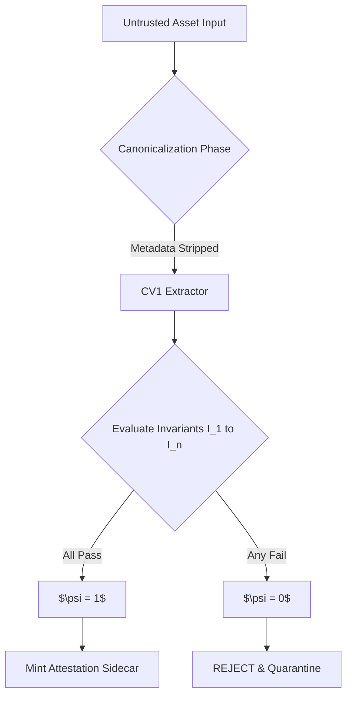

# Mnemosyne Protocol: Deterministic Governance for GenAI
**Formal Specification v1.7 (Draft / Normative)**

[](https://opensource.org/licenses/MIT)
[](https://creativecommons.org/licenses/by/4.0/)
[](https://zenodo.org/)

## 1. Overview
The rapid adoption of Generative AI has introduced ungoverned probabilistic generation risks to enterprise workflows. Current paradigms operating as untrusted "black boxes" fail to provide IP protection and supply-chain integrity. 

The Mnemosyne Protocol introduces a **zero-trust, fail-closed architecture** via an auditable Policy-as-Code layer, mathematically represented by the Boolean conjunction function: $\psi = \bigwedge_{i=1}^{n} I_i(x)$. 

* To read the full mathematical theorem, Merkle Tree implementations, and RFC 8785 Canonicalization specs, please refer to the **[Formal Specification v1.7 Document](./docs/spec/mnemosyne-protocol-v1.7.md)**.

## 2. The $\psi$ (Psi) Theorem Execution Flow


## 3. Usage Example (Conceptual Implementation)
Below is a conceptual Python representation of the Final Gate evaluating an asset against predefined invariants.

```python
from src.psi_theorem import evaluate_psi
from src.canonicalize import jcs_rfc8785

# Define constraints (e.g., emissive budget < 0.72)
invariants = [I1, I2, I3] 

# Untrusted AI Output
asset_payload = {"emissive_budget": "0.720000", "allowed_colors": ["#000000"]}

# Evaluation
psi = evaluate_psi(asset_payload, invariants)

if psi == 1:
    print("ACCEPT: Minting Ed25519 Attestation Sidecar...")
else:
    print("REJECT: Fail-Closed. Policy breach detected.")
```

## 4. Falsifiable Proofs (Test Vectors)
To ensure cross-platform determinism, the protocol mandates the JSON Canonicalization Scheme (RFC 8785). You can verify our core test vector locally:

```bash
echo -n '{"allowed_colors":["#000000","#FFD700"],"emissive_budget":"0.720000"}' | shasum -a 256
# Expected Output: 8d3fd83061563864597b0a898cc2a67c1ca79281005b06aa08e7f73e9dbab2a8  -
```

## 5. Contributing & Security
* For implementation discussions, please open an Issue.
* For vulnerability reporting, please refer to our `SECURITY.md`.
