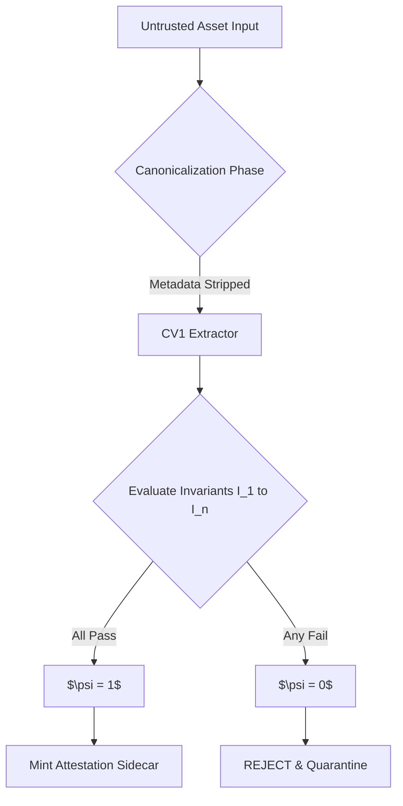

# Mnemosyne Protocol: Deterministic Governance for GenAI

Mnemosyne v2.0: We don't just generate. We mathematically verify. You only pay for ad creatives that pass the P0 Geometrical Lock and receive a cryptographic Evidence Pack.

[

**ABSTRACT:**

While Generative AI (GenAI) systems have revolutionized scalable content creation, they inherently fail to meet the strict Intellectual Property (IP) and brand safety requirements of AAA gaming studios and global Ad-Tech networks. 
In these industries, "similarity" is legally insufficient; deterministic identity preservation is mandatory. Building upon the Mnemosyne Layer-0 Protocol, this application paper introduces the Geometrical IP Lock (GIL) and the Cryptographic Attestation-asa-Service model. By extracting canonical masks and depth envelopes from licensed 3D assets, the system establishes a zero-tolerance baseline. 

The Mnemosyne Core Inference Engine operates strictly as a closed-loop, fail-closed pipeline: any generated variation exhibiting geometric hallucination or brand drift is deterministically rejected. Verified frames are delivered with a cryptographically signed Evidence Pack, effectively monetizing "guaranteed compliance" and provides cryptographic evidence for standardized, data-driven dispute resolution against false-positive copyright claims.

A Zero-Trust, deterministic orchestration layer powered by vector-based Merkle trees and cryptography. This protocol does more than just ensure generative continuity; it enforces absolute local data sovereignty, transforming the generative "black box" into a transparent, rule-abiding state machine.

In a standard Model Context Protocol (MCP), data is pushed to the model, exposing it to the cloud. Mnemosyne introduces a paradigm shift through Inverse Context Flow (ICF). Instead of sending your sensitive data to the cloud, the protocol pulls the model's intelligence into the local environment, mathematically confining it within a strict "fail-closed" architecture.

**Formal Specification v1.7 (Draft / Normative)**

[](https://opensource.org/licenses/MIT)
[](https://creativecommons.org/licenses/by/4.0/)
[](https://doi.org/10.5281/zenodo.18809100)

## 1. Overview

The rapid adoption of Generative AI has introduced ungoverned probabilistic generation risks to enterprise workflows. Current paradigms operating as untrusted "black boxes" fail to provide IP protection and supply-chain integrity. 

The Mnemosyne Protocol introduces a **zero-trust, fail-closed architecture** via an auditable Policy-as-Code layer, mathematically represented by the Boolean conjunction function: $\psi = \bigwedge_{i=1}^{n} I_i(x)$. 

* To read the full mathematical theorem, Merkle Tree implementations, and RFC 8785 Canonicalization specs, please refer to the **[Formal Specification v1.7 Document](./docs/spec/mnemosyne-protocol-v1.7.md)**.

## 2. The $\psi$ (Psi) Theorem Execution Flow


```mermaid

graph TD
    A[Untrusted Asset Input] --> B{Canonicalization Phase}
    B -->|Metadata Stripped| C[CV1 Extractor]
    C --> D{Evaluate Invariants I_1 to I_n}
    D -->|All Pass| E[$\psi = 1$]
    D -->|Any Fail| F[$\psi = 0$]
    E --> G[Mint Attestation Sidecar]
    F --> H[REJECT & Quarantine]

```

## 3. Usage Example (Conceptual Implementation)

Below is a conceptual Python representation of the Final Gate evaluating an asset against predefined invariants.

```python

from src.psi_theorem import evaluate_psi
from src.canonicalize import jcs_rfc8785

# Define constraints (e.g., emissive budget < 0.72)
invariants = [I1, I2, I3] 

# Untrusted AI Output
asset_payload = {"emissive_budget": "0.720000", "allowed_colors": ["#000000"]}

# Evaluation
psi = evaluate_psi(asset_payload, invariants)

if psi == 1:
    print("ACCEPT: Minting Ed25519 Attestation Sidecar...")
else:
    print("REJECT: Fail-Closed. Policy breach detected.")

```

## 4. Falsifiable Proofs (Test Vectors)

To ensure cross-platform determinism, the protocol mandates the JSON Canonicalization Scheme (RFC 8785). You can verify our core test vector locally:

```bash

echo -n '{"allowed_colors":["#000000","#FFD700"],"emissive_budget":"0.720000"}' | shasum -a 256
# Expected Output: 8d3fd83061563864597b0a898cc2a67c1ca79281005b06aa08e7f73e9dbab2a8  -

```

## 5. Contributing & Security

* For implementation discussions, please open an Issue.
* For vulnerability reporting, please refer to our `SECURITY.md`.
