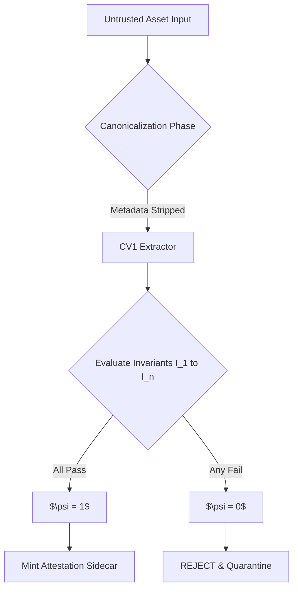
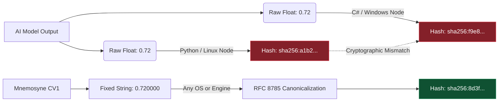

# Mnemosyne Protocol v1.7: Deterministic Governance and Zero-Trust Pipelines
**A Formal Specification (Normative)**

**Document Status:** Formal Specification v1.7 (Draft / Normative)  
**License:** CC BY 4.0 (Specification), MIT (Reference Implementations)  
**Author:** Kerem Salman, Mnemosyne Labs  

## Abstract
The rapid adoption of Generative AI has introduced ungoverned probabilistic generation risks to enterprise workflows. Current paradigms operating as untrusted "black boxes" fail to provide IP protection and supply-chain integrity. The Mnemosyne Protocol introduces a zero-trust, fail-closed architecture via an auditable Policy-as-Code layer, mathematically represented by the Boolean conjunction function $\psi = \bigwedge_{i=1}^{n} I_i(x)$. To solve cross-platform non-determinism, the protocol introduces Canonicalized Constraint Vectors (CV1) using RFC 8785. Visual compliance is cryptographically secured via Merkle Tree constructs, transforming AI swarms into mathematically chained, high-volume labor units under sovereign human authority.

## 0. Terminology
The key words "MUST", "MUST NOT", "REQUIRED", "SHALL", "SHALL NOT", "SHOULD", "SHOULD NOT", "RECOMMENDED", "MAY", and "OPTIONAL" in this document are to be interpreted as described in RFC 2119 and RFC 8174.

## 1. Threat Model & Security Goals
To establish a formal zero-trust pipeline, the protocol defines the following boundaries:
* **The Adversary:** Defined as an untrusted vendor, a compromised internal AI agent, a malicious contractor, or an active supply-chain swap attempting to inject non-compliant assets.
* **Goals:** 1. Intellectual Property (IP) confidentiality and provenance. 2. Cryptographic integrity of the asset pipeline. 3. Strict, auditable adherence to the Determinism Envelope.
* **Non-Goals:** Cross-hardware, pixel-perfect determinism across heterogeneous GPUs is theoretically infeasible and is explicitly *not* a goal.

## 2. The $\psi$ (Psi) Theorem and Normative Execution
The protocol replaces heuristic QA with deterministic invariants. An asset $x$ is evaluated via the $\psi$ Theorem:

$$\psi = \bigwedge_{i=1}^{n} I_i(x)$$

*Note: $\psi = 1$ denotes perfect compliance; any failure collapses the equation to 0, triggering an immediate and unoverrideable REJECT state. (e.g., if $I_1$ representing the emissive budget fails, $\psi = 0$.)*

**Normative Rules:**
* $\psi \in \{0,1\}$ is a boolean acceptance flag.
* If any invariant fails, the system MUST collapse to $\psi = 0$ (Fail-Closed). 
* REJECT decisions MUST be recorded and cannot be bypassed without a policy version bump (SemVer MAJOR). This ensures strict governance.



## 3. Cryptographic Render Proofs & The Determinism Envelope

### 3.1. The Determinism Envelope
Tier A validation MUST occur within a pinned **Determinism Envelope**. To ensure cross-node parity, the envelope MUST be serialized via the JSON Canonicalization Scheme (RFC 8785) and hashed with SHA-256 to produce the `environment_envelope_hash`. 

### 3.2. Merkle Tree Constructs & Membership Proofs
To secure render frames, nodes MUST enforce ASCII domain separation (`LEAF_DOMAIN` and `NODE_DOMAIN`) prior to hashing. 
The protocol utilizes **$O(\log n)$** spot-checks instead of full re-renders. *For example, for a sequence of 1024 high-fidelity frames, verifying a single frame requires computing only ~10 hashes.*

To facilitate this, the system MUST define a verifiable **Proof Object**:
```json
{
  "frame_index": 42,
  "leaf_digest": "sha256:...",
  "path": [
    {"direction": "left", "hash": "sha256:..."},
    {"direction": "right", "hash": "sha256:..."}
  ],
  "root_digest": "sha256:..."
}
```

### 3.3. Performance & Cost Optimization

| Metric | Full Render Verification | Merkle Spot-Check ($O(\log n)$) |
| :--- | :--- | :--- |
| **Compute Cost** | High (GPU Required) | Minimal (CPU Hashing) |
| **Time to Verify (100 frames)** | Minutes to Hours | < 50 milliseconds (on M-series Apple Silicon) |
| **False Reject Risk** | Subject to environment drift | Minimized within envelope; rejects become auditable |

## 4. Constraint Vectors (CV1) and Float Annihilation
Raw JSON floating-point numbers inherently cause cross-platform hash mismatches. The following diagram illustrates the cryptographic fracture caused by raw floats versus the stability of CV1.



* Systems **MUST NOT** use raw JSON floats for continuous metrics.
* All metrics **MUST** be formatted as fixed-point decimal strings (e.g., `"0.720000"`).
* The constraint vector MUST be serialized using the JSON Canonicalization Scheme (RFC 8785) prior to generating the `vector_digest`.

## 5. Digital Attestation Sidecar
Upon achieving $\psi = 1$, the protocol MUST mint the `asset.attestation.json`. The signing authority **SHOULD** use Ed25519 today; a post-quantum signature scheme (e.g., NIST PQC algorithms like Dilithium or Falcon) **MAY** be added in a future revision.

---

## Appendix A: Test Vectors (Falsifiable Proofs)
Verifiers MUST reproduce the following JCS (RFC 8785) digests. 

**Input (CV1 Object):**
```json
{
  "emissive_budget": "0.720000",
  "allowed_colors": ["#000000", "#FFD700"]
}
```
**Expected Canonical JCS String:**
`{"allowed_colors":["#000000","#FFD700"],"emissive_budget":"0.720000"}`

**Expected SHA-256 Digest (Full Hex):**
`sha256:8d3fd83061563864597b0a898cc2a67c1ca79281005b06aa08e7f73e9dbab2a8`

*Terminal Verification Command:*
```bash
echo -n '{"allowed_colors":["#000000","#FFD700"],"emissive_budget":"0.720000"}' | shasum -a 256
# Expected Output: 8d3fd83061563864597b0a898cc2a67c1ca79281005b06aa08e7f73e9dbab2a8  -
```

## Appendix B: Attestation Schema & Sample
The `asset.attestation.json` MUST contain the required cryptographic bindings.

**Sample Implementation:**
```json
{
  "protocol": "mnemosyne:v1.7",
  "asset_identity": {
    "file_name": "hero_mesh_lod0.fbx",
    "asset_cid": "sha256:a1b2c3d4e5..."
  },
  "governance_binding": {
    "policy_hash": "sha256:9f8e7d6c5b4...",
    "psi_evaluation": 1
  },
  "cryptographic_proofs": {
    "cv1_digest": "sha256:8d3fd83061563864597b0a898cc2a67c1ca79281005b06aa08e7f73e9dbab2a8",
    "render_merkle_root": "sha256:1a2b3c4d5e6...",
    "environment_envelope_hash": "sha256:5e6f7g8h9i0..."
  },
  "signature": {
    "ed25519_signature": "e3b0c44298fc1c149afbf4c8996fb92427ae41e4649b934ca4..."
  }
}
```

## Appendix C: The Trust Chain & Sovereign Revocation Model
The Mnemosyne Trust Chain converts probabilistic artifacts into cryptographically sovereign digital assets.

**1. Signature Hierarchy (Dual-Tier PKI)**
* **Tier A (Sovereign Authority):** Cold-storage Ed25519 keys held by human authorities. Used ONLY to sign and publish Policy Bundles.
* **Tier B (Execution Nodes):** Hot keys residing in the CI/CD pipeline. They ONLY mint an attestation sidecar if $\psi = 1$.

**2. Sovereign Revocation Logic (Kill Switch)**
* **Policy Bump Revocation:** If a policy updates (SemVer MAJOR), previous sidecars are flagged as `STALE`.
* **Certificate Revocation List (CRL):** If a poisoned payload is discovered post-ingestion, the `asset_cid` is published to the CRL. 
  * *Offline Mode:* Engine checks a local CRL snapshot on load.
  * *Online Mode:* System performs periodic signed CRL updates via registry polling (e.g., via a designated GitHub repository).
